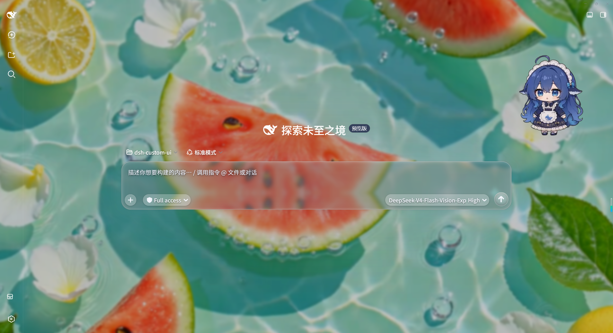

# dsh-glass-ui

> 为 DeepSeek Harness Web 打造的液态玻璃主题 — 磨砂质感、可调色调、动态壁纸，让 DSH 界面焕然一新。



## 核心特性

- **液态玻璃界面**：半透明磨砂面板覆盖整个 DSH 界面，背景层独立模糊，不破坏布局层级
- **调色与浓度**：一键切换 tint 颜色，透明度 10%–95% 无级调节，实时预览
- **动态壁纸引擎**：支持图片（多图轮播）与视频（mp4/webm）双模式，流式预载避免黑闪
- **字体注入**：内置预设字体 + 自定义字体族 + 本地字体文件上传，自动注入 `@font-face`
- **边缘折射**：SVG `feDisplacementMap` 透镜效果，玻璃边界有微弱光晕感
- **磨砂层级**：输入框、气泡、按钮、菜单、弹窗全部支持 `backdrop-filter` 模糊
- **自定义 CSS**：开放高级入口，粘贴任意样式即时生效
- **配置持久化**：所有设置存于 `$DSH_HOME/data/glass-ui/config.json`，支持导出/导入 JSON

## 安装

```sh
# 从 GitHub（推荐）
dsh plugin --profile desktop add github:lkdxzhxi/dsh-glass-ui-theme

# 或从 npm（发布后）
dsh plugin --profile desktop add dsh-glass-ui
```

安装后打开 **设置 → 自定义UI设计** 即可开始。

## 快速上手

1. 打开设置齿轮 → 左侧导航「自定义UI设计」
2. 拖动「透明度」与「模糊」滑块，观察实时预览
3. 切换「液态玻璃」区域：启用磨砂、调节边缘折射强度
4. 选择 tint 颜色（默认青色），调节浓度与壁纸亮度
5. 上传背景图/视频，开启轮播或多图切换
6. 所有修改自动保存，刷新页面保持状态

## 技术栈

- **Host 端**：Cordis Plugin + Node.js 路由（配置持久化、媒体上传）
- **Client 端**：React 18 + TypeScript，`tsdown` 打包为 `__ModuleLoader__` bundle，同时覆盖 web / desktop 两个 profile
- **主题机制**：`ctx.theme.overrideTokens()` 覆盖 DSH 全局 alias token
- **玻璃效果**：`::before` 伪元素承载 `backdrop-filter`，避免破坏 fixed 定位
- **壁纸引擎**：双缓冲图片交叉淡入淡出；视频预载到 `loadeddata` 再淡入

## 兼容性

- 支持 **DSH Desktop** 与 **DSH Web** 双 profile（`--profile desktop` 或 `--profile web`）
- 支持 Chrome/Edge 91+（`backdrop-filter` 完整支持）
- 与 dsh-better-sidebar 等第三方插件兼容

## 开发

```sh
pnpm install
pnpm build          # 构建 host + client
pnpm typecheck      # 类型检查
```

本地开发时，将插件 link 到 DSH 任意 profile（desktop / web）并开启 `patchReload: "live"`。

## License

MIT
